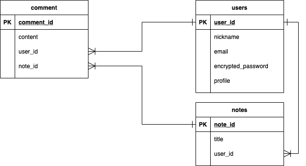

# アプリケーション名
**『My Notes』**
# アプリケーション概要
このアプリケーションは学習用のメモアプリケーションです。

# URL

# テスト用アカウント
アプリケーション内でゲストユーザーを選択してください。

# 利用方法
まずユーザー登録をする必要があります。

## 新規メモ作成機能
検索フォームの下にあるペンのアイコンをクリックすると新規メモが作成できます。メモは自動保存されますので記入したら保存されます。

## メモ一覧
作成したメモは本の左側に一覧表示され、更新順に並んでいます。

## メモ検索機能
本の左側にある検索フォームにメモのタイトルを入力するとヒットしたメモだけメモ一覧に残ります。

## メモ編集機能
メモ一覧からタイトルをクリックすると作成したメモの編集ページに遷移します。新規メモ作成と同様にメモは自動保存されます。

## 画像添付機能
画像をドラッグ&ドロップまたは画像添付ボタンをクリックするとメモに画像を載せることができます。

## ログアウト機能
新規メモ作成及びメモ編集画面にて、右側下部のツールバーの走っている人のアイコンをクリックするとログアウトすることができます。誤ってクリックしてしまった時のために、アラートが表示されるようになっています。

## ユーザ編集機能
新規メモ作成及びメモ編集画面にて、右側下部のツールバーの左から2番目のアイコンをクリックすると登録したニックネームとメールアドレスを変更できます。

## チャット添削機能
新規メモ作成及びメモ編集画面にて、右側下部のツールバーの右から2番目のアイコンをクリックすると、チャットページに遷移します。そのページのURLを知っており、ログインしているユーザは誰でもチャットに参加することができます。右側には作成したメモが表示され、そのメモを見ながらチャット形式で添削を行うことができます。チャットは保存されており、メモを削除するとチャットも削除されます。チャットページにて右側下部のツールバーの右端のアイコンをクリックすると退出できます。

## メモ削除機能
右側下部のツールバーのゴミ箱のアイコンをクリックするとメモを削除することができます。誤ってクリックしてしまった時のために、アラートが表示されるようになっています。

# 目指した課題解決
このアプリケーションは学習中にノートをとっている時に「どこに書いているかわからなくなった」「自分で書いたノートの内容が本当に合っているのか」という問題意識から生まれました。学習ノートをとっていくうちにどこに書いてあるかわからなくなり、探す時間を無駄にしてしまったり、同じことを何度も書いてしまうことがあるかと思います。また、自己流でノートをとっていくことで、間違った認識をしてしまい、非効率な学習になってしまったこともあるかと思います。効率よく、手軽に学習を進めていけるように、このアプリケーションを使って楽しくスキルアップができるようになればと思い、作成しました。

# 洗い出した要件

|優先順位 3~1|機能        |目的         |詳細        |ストーリー |見積もり|
|--------------------------|----------- |------------|-----------|----------|------|
|3|メモ機能|学習内容をメモできるようにするため|・メモ一覧表示 ・新規メモ作成機能   ・メモ編集機能   ・メモ削除機能  |・新しいメモを作成できる ・メモの一覧が表示される ・メモを編集できる ・メモを削除できる ・シンプルなノートのようなの表示  |10h|
|3|検索機能|メモを検索できるようし、学習時間の効率を上げるため|検索フォームを用意し、メモのタイトルを入力すれば一覧が表示される|・メモを検索できる ・非同期で検索でき、ストレスなく検索できる  |10h|
|3|ユーザ登録機能|ユーザごとにメモを管理し、信頼性を高めるため|・ユーザ詳細ページ ・ユーザ新規登録機能 ・ユーザ詳細ページ編集機能 ・ログイン・ログアウト機能  |・ニックネームとEmailとパスワードだけで登録できる ・登録が簡単にできる ・ユーザの詳細ページからユーザ情報を編集できる  |10h|
|3|チャット機能|自分で書いたメモを共有でき、チャット形式で添削をしてもらえるようにするため|・チャット機能 ・チャットページのURLを知っていれば複数人でもチャットができる  |メモはしたがあっているかどうか不安な時に添削して欲しい人にURLを送信することで、会話しているように添削ができる|15h|
|2|画像添付機能|メモに画像を付けられるようにするため|・Action_textを使った画像添付機能 ・複数枚の画像を添付できる  |メモの内容記入欄に画像をドラッグ&ドロップまたは画像添付ボタンをクリックすることでメモに画像を添付できる|5h|

# 実装した機能について
## 新規登録

## ログイン

## ユーザ情報編集

## 新規メモ作成

## メモ一覧

## メモ検索

## メモ編集

## メモ削除

## メモ編集

## 画像添付

## チャット

# テーブル設計
## ER図

## usersテーブル

| column             | type   | option   |
|------------------- |------- |--------- |
| nickname           | string | NOT NULL |
| email              | string | NOT NULL |
| encrypted_password | string | NOT NULL |

### Association

- has_many :notes
- has_many :comments

## notesテーブル

| column           | type       | option                            |
|----------------- |------------|-----------------------------------|
| title            | string     | NOT NULL                          |
| user_id          | references | foreign_key :true, NOT NULL :true |

content(本文)はAction Textを使用。
imageはActive Storageを使用

### Association
- belongs_to :user
- has_many :comments, dependent: :destroy

## commentsテーブル

| column     | type       | option                            |
|------------|------------|---------------------------------- |
| text       | text       | NOT NULL                          |
| user_id    | references | foreign_key :true, NOT NULL :true |
| note_id    | references | foreign_key :true, NOT NULL :true |

### Association

- belongs_to :note
- belongs_to :user